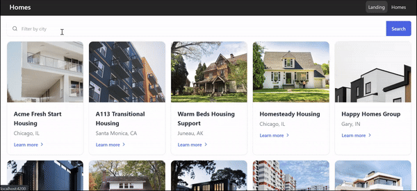

# House Listing

A house listing application that allows users to view a list of house for rent and their details.



## Features

- View a list of houses
- View details of a house
- Search for a hosue based on city
- Apply for a house

## Getting Started

### Installation

1. Follow the instructions in the [README.md](../../README.md) file to clone the repository and install dependencies.
```bash
git clone
pnpm install
```
2. Navigate to the `projects/house-list` directory.

### Running the Application

1. Run the Angular CLI development server

```bash
ng serve
```

2. Run mock server

```bash
json-server --watch db.json
```

3. Start the application

```bash
ng serve
```

4. Navigate to `http://localhost:4200/` in your browser.

## Credits

- [Build Angular App](https://angular.dev/tutorials/first-app)
