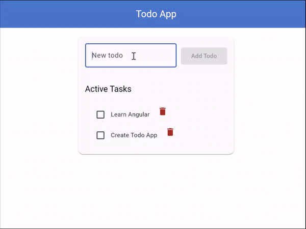

# Todo App

A simple todo list application that allows users to add and delete tasks.



## Features

- Add tasks
- Mark tasks as completed
- Delete tasks

## Getting Started

1. Follow the instructions in the [README.md](../../README.md) file to clone the repository and install dependencies.
```bash
git clone
pnpm install
```
2. Run `ng serve` to start the development server and navigate to `http://localhost:4200/` in your browser.
```bash
ng serve
```