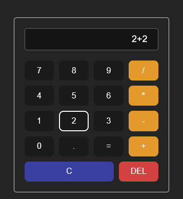

# Calculator

A simple calculator that can perform basic arithmetic operations built using Vue.js.

## Development

### Prerequisites
- Node.js
- pnpm

### Setup

1. Clone the repository and navigate to the project directory
2. Install the dependencies using `pnpm install`
3. Run the development server using `pnpm dev`
4. Open the browser and navigate to `http://localhost:5173/`

### Deployment

The project is deployed to netlify and can be accessed [here](https://vue-calculator.netlify.app/)

## Contributing

Contributions are welcome! Feel free to open an issue or submit a pull request if you have any suggestions or improvements.
