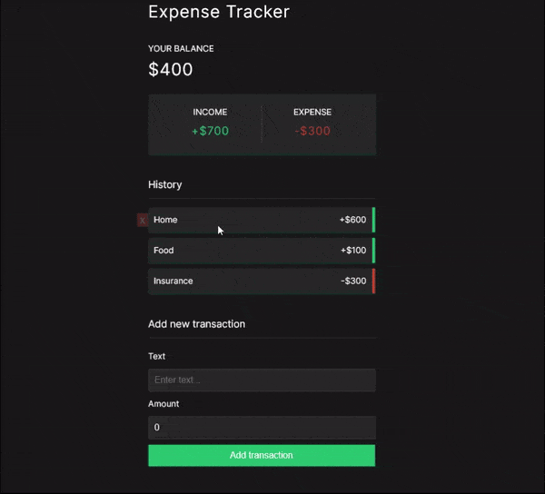

# expense-tracker

A simple expense tracker built with Vue 3 and TypeScript.



View the live demo [here](https://sreeharsha-rav.github.io/frontend-projects/)!.

## Features

- Add, remove and edit transactions
- View total balance, income and expenses

## Project Setup

```sh
pnpm install
```

### Compile and Hot-Reload for Development

```sh
pnpm dev
```

### Type-Check, Compile and Minify for Production

```sh
pnpm build
```

### Lint with [ESLint](https://eslint.org/)

```sh
pnpm lint
```
