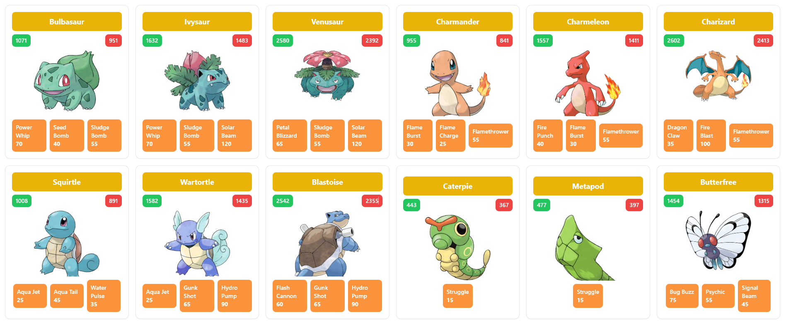

# Pokemon GraphQL

This is a simple GraphQL client for the Pokémon API. It displays a list of Pokémon and their details from a GraphQL server.



## Getting Started

### Technologies

- React (TypeScript + Vite)
- GraphQL
- Apollo
- Tailwind CSS
- pnpm
- Pokemon open API

### Installation

1. Clone the repository:

```bash
git clone
```

2. Install the dependencies:

```bash
pnpm install
```

3. Start the development server:

```bash
pnpm dev
```

4. Open the browser and navigate to `http://localhost:5173`.

## Credits

- [Pokémon GraphQL](https://graphql-pokeapi.vercel.app/) - Pokémon GraphQL API