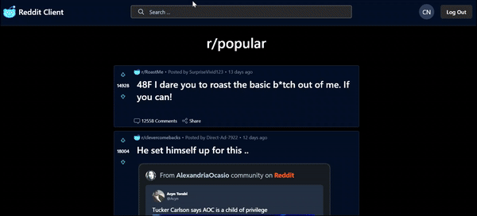

# Reddit Client

A simple Reddit client built with Next.js. It fetches data from the Reddit API and displays it in a clean, user-friendly interface. Dive into your favorite subreddits and explore the latest posts with ease.



## Features

- View posts from the front page
- View subreddits
- View posts from subreddits

## Project Structure

The project is structured as follows:

```plaintext
reddit-client/
├── src/                                # Source directory containing all application code
│   ├── app/                            # Main directory for Next.js App Router
│   │   ├── r/                          # Subreddit routes
│   │   │   ├── [subreddit]/            # Dynamic route for individual subreddits
│   │   │   │   ├── page.tsx            # Subreddit page component
│   │   │   │   └── [postId]/           # Dynamic route for individual posts
│   │   │   │       └── page.tsx        # Post page component
│   │   ├── search/                     # TODO: Search Functionality
│   │   │   └── page.tsx                # TODO: Search page component
│   │   ├── layout.tsx                  # Root layout component
│   │   ├── not-found.tsx               # Not found page component
│   │   └── page.tsx                    # Home page component
│   ├── components/                     # Reusable React components
│   │   ├── ui/                         # Basic UI components
│   │   │   ├── Button.tsx              # Button component
│   │   │   ├── Input.tsx               # Input component
│   │   │   └── ...                     # Other UI components
│   │   ├── PostCard.tsx                # Component for displaying a post
│   │   ├── CommentSection.tsx          # Component for displaying comments
│   │   ├── SubredditSidebar.tsx        # Sidebar component for subreddit info
│   │   ├── Header.tsx                  # Header component
│   ├── lib/                            # Utility functions and modules
│   │   ├── reddit-api.ts               # Reddit API interaction functions
│   │   └── utils.ts                    # General utility functions
│   ├── hooks/                          # Custom React hooks
│   │   ├── usePosts.ts                 # Hook for fetching and managing posts
│   │   ├── useComments.ts              # Hook for fetching and managing comments
│   │   └── useSubreddit.ts             # Hook for fetching subreddit info
│   ├── types/                          # TypeScript type definitions
│   │   └── index.ts                    # Centralized type definitions
│   └── styles/                         # Global styles
│       └── globals.css                 # Global CSS file
├── public/                             # Static assets (outside src as per Next.js convention)
│   └── images/                         # Image assets
├── .env.local                          # Environment variables (gitignored)
├── next.config.js                      # Next.js configuration
├── package.json                        # Project dependencies and scripts
└── tsconfig.json                       # TypeScript configuration
```

## Getting Started

### Development

1. Clone the repository:

```bash
git clone
```

2. Install the dependencies:

```bash
pnpm install
```

3. **Important!** Add your Reddit API credentials to a `.env.local` file. You can create a Reddit app and get your credentials [here](https://www.reddit.com/dev/api). You can use this guide to get client ID and client secret from Reddit: [Reddit API Setup](https://rymur.github.io/setup).

```plaintext
CLIENT_ID=YOUR_CLIENT_ID
CLIENT_SECRET=YOUR_CLIENT_SECRET
```

4. Run the development server:

```bash
pnpm dev
```

### Production

1. Build the project:

```bash
pnpm build
```

2. Start the production server:

```bash
pnpm start
```

### Testing

Run the tests:

```bash
pnpm test
```

## Development Roadmap

**Version 0.1.0**
- [x] View posts from the front page
- [x] View subreddits
- [x] View posts from subreddits
- [ ] View error page
- [ ] View loading page
- [ ] View empty state
- [ ] React Suspense for loading states
- [ ] React Streaming for data fetching

**Version 0.2.0**
- [ ] Search for subreddits
- [ ] Search for posts
- [ ] View comments

**Version 0.3.0**

- [ ] Vote on posts
- [ ] Save posts

## License

This project is open source and available under the [MIT License](LICENSE).