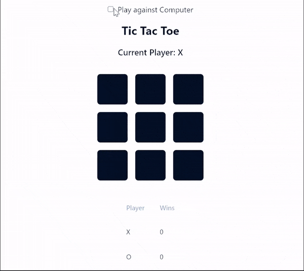

# Tic Tac Toe

A simple Tic Tac Toe game in React with a computer opponent.
[LIVE DEMO](https://tic-tac-5q0pox74s-sreeharsha-ravs-projects.vercel.app/)

## Installation

1. Clone the repository
2. Run `pnpm install`
3. Run `pnpm dev`
4. Open `http://localhost:5173` in your browser

## Features

- Play against a computer opponent
- Play again after the game is over
- See the game score

## Technologies

- React
- TypeScript
- Tailwind CSS
- Vite

## Future Improvements

- [ ] Add a difficulty setting for the computer opponent
- [ ] Ability to choose X or O

## Credits

- This project was bootstrapped with [Vite](https://vitejs.dev/).
- The Tic Tac Toe game logic is based on the [React tutorial](https://react.dev/learn/tutorial-tic-tac-toe).
