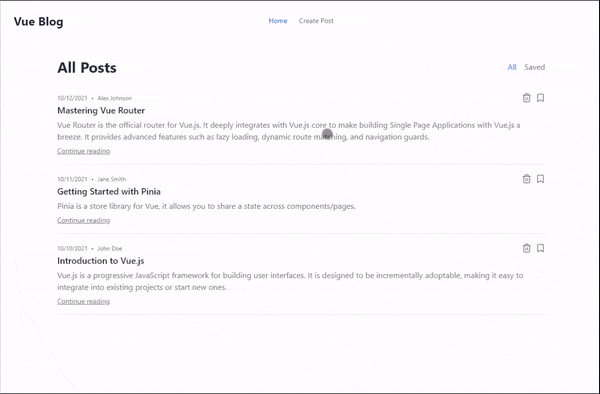

# vue-blog

## Description

A minimal blog built with Vue.js and Tailwind CSS. A development project to learn Vue 3 Composition API, Pinia, and Vue Router.



### Features

- Create new posts
- Delete posts
- Bookmark posts
- Filter posts by bookmarked status

### Technologies

- Vue 3
- Vue Router
- Pinia
- Tailwind CSS
- TypeScript

## Project Setup

```sh
pnpm install
```

### Development with JSON Server

```sh
pnpm dev
pnpm mock-server
```

### Type-Check, Compile and Minify for Production

```sh
pnpm build
```

### Lint with [ESLint](https://eslint.org/)

```sh
pnpm lint
```

## Contributing

Contributions, issues and feature requests are welcome! Feel free to submit a pull request.

## Credits

- Developed with the guide of [Learn with Jon - Vue Composition API, Pinia, Router](https://youtu.be/WSh8iiWgOLg?si=uM8hHqCTg3j5UesK)
